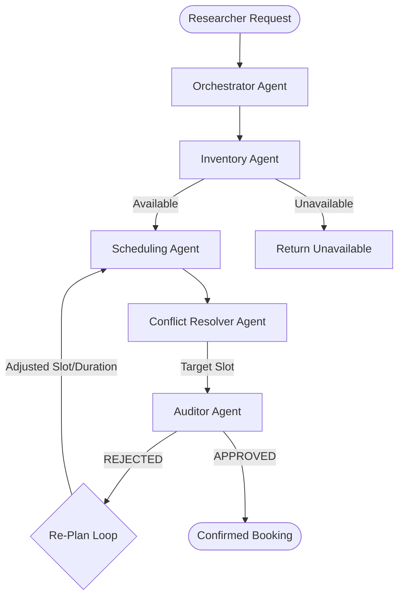

# Smart Laboratory Resource Agent 🔬🤖

A modular multi-agent AI system for automated laboratory resource scheduling, inventory validation, conflict resolution, and safety/compliance auditing.

Built for hackathons with **Python**, **OpenAI**, **LangChain**, and extensible backend tool interfaces.

---

## 📁 Project Structure

```
agents/
├── __init__.py           # Package exports
├── orchestrator.py       # Master agent: NL request parsing, coordination, re-planning loop
├── inventory_agent.py    # Inventory validation & backend tool interface
├── scheduling_agent.py   # Calendar slot checking & available slot finder
├── conflict_agent.py     # Conflict detection & alternative slot recommendation
└── auditor_agent.py      # Safety & lab compliance verification (operating hours, duration)
demo.py                   # End-to-end multi-agent demonstration script
tests/
└── test_agents.py        # Automated unit test suite
```

---

## 🧩 Multi-Agent Architecture



### Agent Roles

1. **Orchestrator Agent (`orchestrator.py`)**
   - Ingests natural-language laboratory resource requests.
   - Extracts equipment, target date, time window, duration, and experimental purpose.
   - Coordinates execution across specialized sub-agents.
   - **Automated Re-Planning**: If the Auditor Agent rejects a booking (e.g. policy violations such as duration > 4 hours or outside operating hours), the Orchestrator intelligently adjusts parameters and re-evaluates the pipeline.

2. **Inventory Agent (`inventory_agent.py`)**
   - Validates whether requested equipment exists and is operational (`AVAILABLE`, `MAINTENANCE`, `DECOMMISSIONED`).
   - Uses `LabInventoryBackendInterface` which can be swapped with live databases / REST APIs.

3. **Scheduling Agent (`scheduling_agent.py`)**
   - Checks requested time slots against existing reservations.
   - Calculates duration and finds open time windows within laboratory operating hours (08:00 - 20:00).
   - Uses `LabSchedulingBackendInterface`.

4. **Conflict Resolver Agent (`conflict_agent.py`)**
   - Detects booking overlaps with other researchers.
   - Recommends the optimal alternative slot closest to the requested time.
   - Provides clear decision justification.

5. **Auditor Agent (`auditor_agent.py`)**
   - Enforces safety, compliance, and lab rules:
     - Laboratory operating hours (08:00 - 20:00).
     - Maximum single-session continuous duration (default: max 4.0 hours).
     - Valid experimental research purpose.
     - Equipment operational readiness.
   - Returns `APPROVED` or `REJECTED` with specific policy violation details and re-plan suggestions.

---

## 🚀 Quick Start

### 1. Run Verification Demo
Run the 4 built-in scenarios (Direct Booking, Conflict Resolution, Policy Re-Planning, Maintenance Rejection):

```bash
python demo.py
```

### 2. Run Unit Tests
```bash
python -m unittest tests/test_agents.py
```

### 3. Usage Example in Python

```python
from agents import LabOrchestrator

# Initialize Orchestrator (uses OPENAI_API_KEY if available, with intelligent fallback)
orchestrator = LabOrchestrator()

# Process natural language request
request = "Book the Confocal Microscope on 2026-08-25 from 10:00 to 12:00 for fluorescent cell imaging"
result = orchestrator.process_request(request)

print(result.status)
print(result.summary_message)
print(result.final_booking)
```
